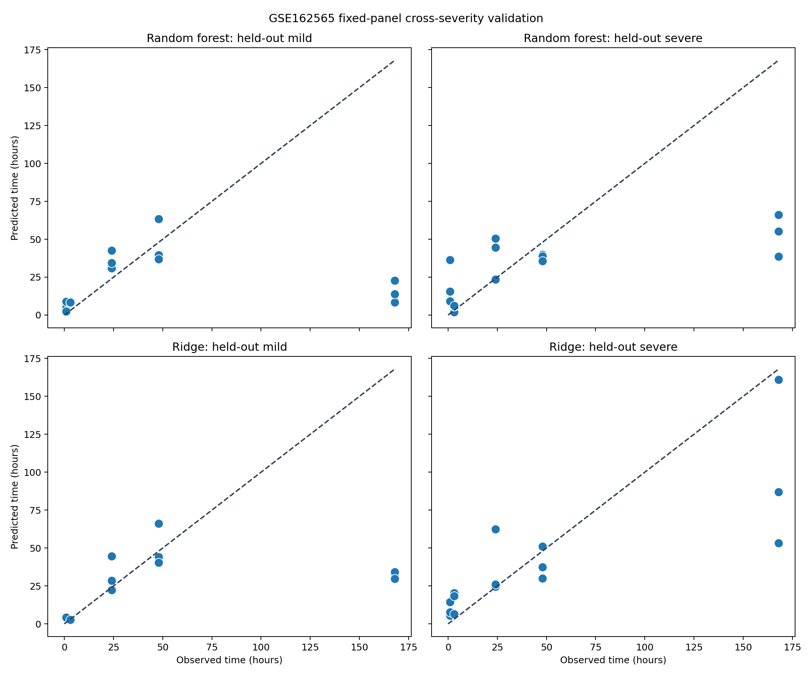

# ChronosWound

### Explainable multimodal wound-age estimation from molecular and histological signals

[](https://github.com/YOUR_USERNAME/chronoswound/actions/workflows/ci.yml)
[](https://www.python.org/)
[](LICENSE)

ChronosWound is a research prototype for estimating elapsed time since injury from a combination of gene-expression, inflammatory-cell and tissue-remodelling measurements. It turns an earlier independent project—*Studying the Ageing of Injuries Using a Gene-Expression Approach*—into a reproducible bioinformatics workflow.

The repository has three deliberately separated evidence tracks: pooled human burn-margin transcriptomics (**GSE8056**), cross-severity validation in individual rat contusions (**GSE162565**), and a synthetic modelling sandbox for software demonstration.

> **Research use only.** Neither the real-data analyses nor the synthetic estimator are clinically or forensically validated. Outputs must not be used as evidence in real cases.

## Why this problem matters

Wounds change through overlapping haemostatic, inflammatory, proliferative and remodelling phases. No single marker acts as a perfect clock: transcriptional signals, immune-cell composition and extracellular-matrix changes are affected by tissue, health, treatment and environment. ChronosWound therefore treats wound age as a **multimodal, uncertainty-aware regression problem**, rather than presenting one biomarker as determinative.

## What the project demonstrates

- A biologically structured panel spanning early inflammation (`IL6`, `TNF`, `CXCL8`), leukocyte recruitment (`MPO`, `CD68`) and repair/remodelling (`VEGFA`, `COL1A1`, `MMP9`, `TGFB1`)
- Synthetic cohort generation with donor effects, technical noise and biologically plausible temporal patterns
- A leakage-resistant `GroupKFold` evaluation strategy that keeps samples from the same donor together
- Comparison of elastic-net and random-forest regressors
- Residual-calibrated 90% prediction intervals
- Permutation importance and residual diagnostics for transparent model assessment
- A command-line interface, automated tests and continuous integration
- Real human transcriptomics: PCA, marker heatmaps and FDR-ranked temporal signals from GSE8056
- An optional Streamlit prediction explorer with an unavoidable research-only warning
- Locked-panel leave-one-array-out testing with exact confidence intervals and permutation testing
- Cross-severity validation using 30 individually sampled rat contusions from GSE162565

## Repository map

```text
chronoswound/
├── src/chronoswound/       # reusable package
│   ├── data.py             # validation and synthetic cohort generation
│   ├── features.py         # phase-informed feature engineering
│   ├── modelling.py        # grouped CV, selection and uncertainty
│   ├── real_data.py        # GSE8056 ingestion and exploratory analysis
│   ├── validation.py       # fixed-panel human time-bin stress tests
│   ├── cross_context.py    # GSE162565 severity-transfer analysis
│   ├── reporting.py        # figures and machine-readable metrics
│   └── cli.py              # end-to-end command line interface
├── tests/                  # unit and integration tests
├── data/                   # generated locally; raw data are never committed
├── reports/figures/        # generated model outputs
└── .github/workflows/      # continuous integration
```

## Quick start

```bash
git clone https://github.com/YOUR_USERNAME/chronoswound.git
cd chronoswound
python -m venv .venv
source .venv/bin/activate       # Windows: .venv\Scripts\activate
pip install -e ".[dev]"

chronoswound generate --samples 360 --output data/synthetic_wounds.csv
chronoswound train --input data/synthetic_wounds.csv --output reports
chronoswound real-analysis --output reports/gse8056
chronoswound cross-context --output reports/gse162565
pytest
```

The real-data command downloads the NCBI GEO series matrix and platform annotation, then reproduces the exploratory analysis. See the [`GSE8056 dataset card`](docs/GSE8056_DATASET_CARD.md) before interpreting any result.

The training command creates:

- `reports/metrics.json` — cross-validated and hold-out performance;
- `reports/predictions.csv` — observed age, prediction and interval bounds;
- `reports/model.joblib` — fitted pipeline plus model card metadata;
- `reports/figures/predicted_vs_observed.png`;
- `reports/figures/residuals.png`;
- `reports/figures/feature_importance.png`.

## Input schema

Each row represents one sampled wound. `donor_id` is mandatory because observations from the same person must not be split across training and test folds.

| Field | Meaning | Unit |
|---|---|---|
| `donor_id` | De-identified participant grouping key | — |
| `wound_age_hours` | Reference elapsed time (training target) | hours |
| `IL6` … `TGFB1` | Normalised gene-expression values | log2-like AU |
| `neutrophil_pct` | Histological neutrophil proportion | % |
| `fibroblast_pct` | Histological fibroblast proportion | % |
| `temperature_c` | Sample storage/ambient covariate | °C |

Real datasets should additionally record tissue site, injury mechanism, sampling method, comorbidities, medication, infection status, post-mortem interval, RNA quality and assay batch. These are potential confounders—not optional administrative details.

## Modelling design

1. Reserve entire donors as a final test set.
2. Engineer three transparent phase scores: inflammation, repair and remodelling.
3. Tune candidate models using grouped cross-validation on training donors only.
4. Select the model with the lowest grouped-CV MAE.
5. Use calibration-donor residuals to estimate a distribution-free 90% error radius.
6. Refit on development data and evaluate once on untouched test donors.

MAE is the primary metric because its unit—hours—is directly interpretable. RMSE exposes occasional large errors, while interval coverage tests whether the stated uncertainty behaves as intended.

## Real-data analysis

The public **GSE8056** study contains 12 human microarrays: three pooled arrays from each of 0–3, 4–7 and >7 days after thermal injury, plus three normal-skin controls. ChronosWound downloads the processed matrix from GEO, maps GPL570 probes to gene symbols, performs PCA, visualises a locked wound-response panel and ranks temporal signals using an exploratory one-way ANOVA with Benjamini–Hochberg correction.

The repository reports a constrained leave-one-array-out test using only the [locked marker panel](docs/BIOMARKER_PROTOCOL.md), accompanied by exact confidence intervals, a permutation test and an injured-only sensitivity analysis. It reports array-level stress-test performance—not patient-level accuracy—and foregrounds the instability caused by only twelve pooled arrays.

For complementary evidence, GSE162565 provides 30 individually sampled rat muscle contusions at five exact time points under mild and severe injury. ChronosWound trains on one severity and tests unchanged on the other. This probes severity robustness while remaining explicitly labelled as cross-species, cross-tissue evidence rather than human external validation.

### Results snapshot

| Evaluation | Model | Result | Essential qualification |
|---|---|---:|---|
| Human four-group leave-one-array-out | Fixed-panel nearest centroid | 83.3% accuracy | 95% CI 51.6–97.9%; pooled arrays |
| Human injured-only time bins | Fixed-panel nearest centroid | 88.9% accuracy | 95% CI 51.8–99.7%; nine arrays |
| Rat mild → severe | Ridge | 22.4 h MAE | Bootstrap 95% CI 8.6–41.1 h |
| Rat severe → mild | Ridge | 31.7 h MAE | Bootstrap 95% CI 6.5–59.7 h |
| Rat median baseline | No molecular features | 42.4 h MAE | Same value in both directions |




Read the [study protocol](docs/STUDY_PROTOCOL.md) and [risk-of-bias register](docs/RISK_OF_BIAS.md) before the results.

The biological and dataset search is recorded in the [rapid literature-search trail](docs/LITERATURE_SEARCH.md); it is explicitly scoped as a reproducible search rather than mislabelled as a systematic review.

For a paper-style account of the completed analyses, including negative and asymmetric findings, see the [results manuscript](docs/RESULTS_MANUSCRIPT.md) and [model card](MODEL_CARD.md).

Launch the optional interface after training the demonstration model:

```bash
pip install -e ".[app]"
streamlit run app.py
```

## Extending this into real research

A credible validation study would preregister marker selection and endpoints; recruit across clinically important age ranges and wound types; use independent sites and batches; benchmark against blinded forensic-pathologist estimates; quantify intra-wound heterogeneity; and report subgroup calibration. External validation is essential before any claim of forensic utility.

## Ethical position

An algorithmic estimate could influence legal decisions and must never be presented without its uncertainty, provenance and limitations. Performance averages can conceal systematic error across ancestry, age, health status or tissue type. ChronosWound therefore makes grouped evaluation and interval reporting defaults, not add-ons.

## Citation

If adapting the repository, cite it using the metadata in [`CITATION.cff`](CITATION.cff).

## Licence

MIT. See [`LICENSE`](LICENSE).
