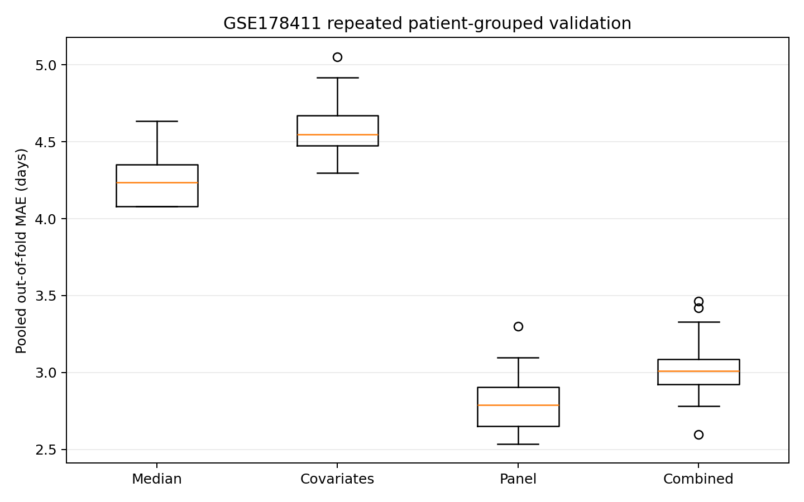
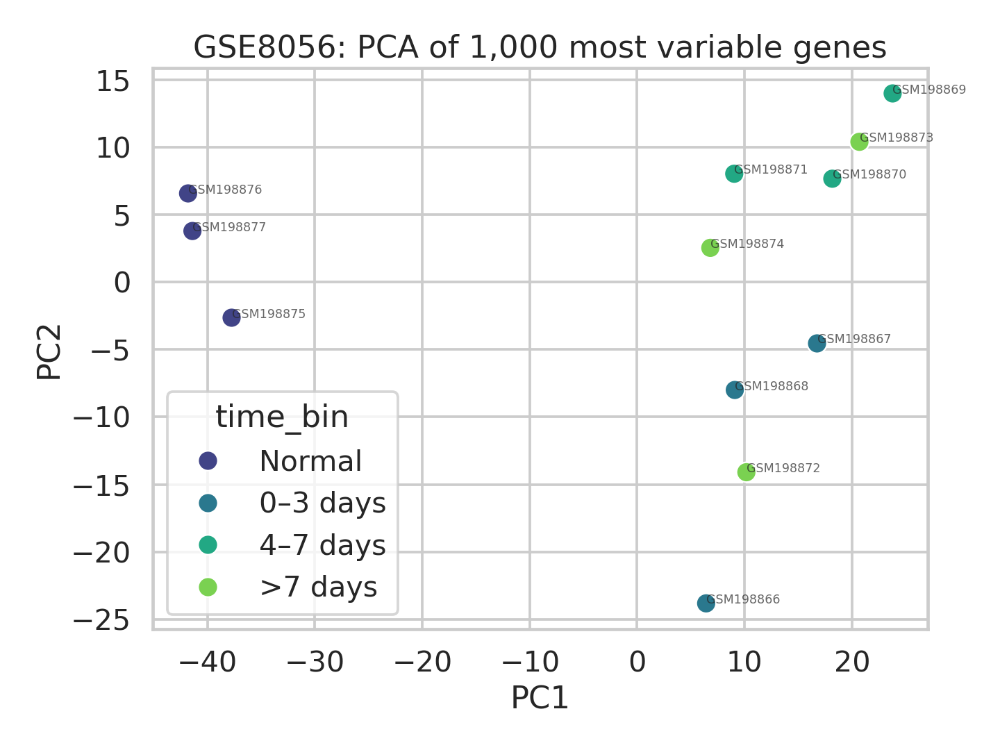

# ChronosWound

### A prospective test of transcriptomic resolution for subacute burn-wound age

[](https://github.com/s4hra1i/chronoswound/actions/workflows/ci.yml)
[](https://www.python.org/)
[](LICENSE)

ChronosWound turns an earlier independent project—*Studying the Ageing of Injuries Using a Gene-Expression Approach*—into a reproducible test of whether a fixed transcript panel can resolve the age of surgically sampled burn wounds between 3 and 27 days after injury.

The primary analysis uses patient-level human RNA-seq from **GSE178411**. Earlier human pooled-array work (**GSE8056**) and rat cross-severity transfer (**GSE162565**) are retained as exploratory evidence. Synthetic data are software-test fixtures only; their predictive performance is not biological evidence.

> **Research use only.** Neither the real-data analyses nor the synthetic estimator are clinically or forensically validated. Outputs must not be used as evidence in real cases.

## Primary result: prospectively evaluated GSE178411 cohort

The analysis was run after public tag [`gse178411-protocol-v1.0`](https://github.com/s4hra1i/chronoswound/releases/tag/gse178411-protocol-v1.0), using code commit `b56ae32`. Before that tag, only metadata structure, cohort eligibility, target distribution, repeated-patient structure and locked-marker presence had been audited; no GSE178411 expression–outcome model had been examined.

The locked 15-gene ridge model achieved a mean repeated patient-grouped out-of-fold MAE of **2.80 days**, compared with **4.26 days** for the training-fold median: a **34.3% reduction**. The patient-clustered BCa estimate of the improvement was 1.46 days (95% CI 0.68–2.43), and none of 199 full-pipeline patient-block permutations matched it (one-sided Monte Carlo *p*=0.005). All three prospectively fixed success conditions were met.

| Identical 49-sample evaluation | Mean MAE | Across-seed range | Interpretation |
|---|---:|---:|---|
| Training-fold median | 4.26 d | 4.08–4.63 d | Primary baseline |
| Covariates only | 4.58 d | 4.30–5.05 d | Age, sex, burn type and location did not beat the median |
| Locked 15-gene panel | **2.80 d** | 2.54–3.30 d | 34.3% lower MAE than baseline; prospective rule met |
| Covariates + panel | 3.03 d | 2.60–3.46 d | Better than covariates alone, but worse than the panel alone |



This is evidence of molecular resolution only for surgically sampled burn wounds in this cohort's **3–27-day** range. It does not validate injuries under 72 hours, other wound mechanisms, post-mortem samples or forensic casework. The target is concentrated at surgical scheduling intervals, only nine patients contribute repeated eligible samples, and collection-year/RNA-integrity confounding cannot be tested.

## Existing exploratory evidence

| Evaluation | Result | Essential qualification |
|---|---:|---|
| GSE8056 four-group arrays | 83.3% accuracy | Exploratory; 95% CI 51.6–97.9%; 12 pooled arrays; panel ordering not independently verifiable from commit history |
| GSE8056 injured-only bins | 88.9% accuracy | Exploratory; 95% CI 51.8–99.7%; nine pooled arrays |
| Rat mild → severe, ridge | 22.4 h MAE; R² 0.610 | Cross-species and cross-tissue; not human validation |
| Rat severe → mild, ridge | 31.7 h MAE; R² 0.018 | Essentially no explained variance in this direction |
| Rat severe → mild, random forest | 37.3 h MAE; R² −0.240 | Worse than predicting the mean |

## Why this problem matters

Wounds change through overlapping haemostatic, inflammatory, proliferative and remodelling phases. No single marker acts as a perfect clock: transcriptional signals and extracellular-matrix changes are affected by tissue, health, treatment and environment. ChronosWound therefore treats wound age as a constrained, uncertainty-aware regression problem rather than presenting one biomarker as determinative.

## What the project demonstrates

- A biologically structured panel spanning early inflammation (`IL6`, `TNF`, `CXCL8`), leukocyte recruitment (`MPO`, `CD68`) and repair/remodelling (`VEGFA`, `COL1A1`, `MMP9`, `TGFB1`)
- A prospectively tagged protocol with an explicit negative-result rule
- Repeated patient-grouped evaluation with all fold assignments and fold-level errors retained
- Direct comparison of training-median, covariates-only, locked-panel and combined ridge models
- Patient-clustered BCa uncertainty and a full-pipeline patient-block permutation test
- Synthetic cohort generation retained only to test software behaviour
- A command-line interface, automated tests and continuous integration
- Real human transcriptomics: PCA, marker heatmaps and FDR-ranked temporal signals from GSE8056
- An optional Streamlit prediction explorer with an unavoidable research-only warning
- Locked-panel leave-one-array-out testing with exact confidence intervals and permutation testing
- Cross-severity validation using 30 individually sampled rat contusions from GSE162565

## Repository map

```text
chronoswound/
├── src/chronoswound/       # reusable package
│   ├── data.py             # validation and synthetic cohort generation
│   ├── features.py         # phase-informed feature engineering
│   ├── modelling.py        # grouped CV, selection and uncertainty
│   ├── real_data.py        # GSE8056 ingestion and exploratory analysis
│   ├── validation.py       # fixed-panel human time-bin stress tests
│   ├── cross_context.py    # GSE162565 severity-transfer analysis
│   ├── gse178411.py        # prospectively specified primary human analysis
│   ├── reporting.py        # figures and machine-readable metrics
│   └── cli.py              # end-to-end command line interface
├── tests/                  # unit and integration tests
├── data/                   # generated locally; raw data are never committed
├── reports/figures/        # generated model outputs
└── .github/workflows/      # continuous integration
```

## Quick start

```bash
git clone https://github.com/s4hra1i/chronoswound.git
cd chronoswound
python -m venv .venv
source .venv/bin/activate       # Windows: .venv\Scripts\activate
pip install -e ".[dev]"

chronoswound generate --samples 360 --output data/synthetic_wounds.csv
chronoswound train --input data/synthetic_wounds.csv --output reports
chronoswound real-analysis --output reports/gse8056
chronoswound cross-context --output reports/gse162565
chronoswound gse178411 --output reports/gse178411
pytest
```

The real-data command downloads the NCBI GEO series matrix and platform annotation, then reproduces the exploratory analysis. See the [`GSE8056 dataset card`](docs/GSE8056_DATASET_CARD.md) before interpreting any result.

The training command creates:

- `reports/metrics.json` — cross-validated and hold-out performance;
- `reports/predictions.csv` — observed age, prediction and interval bounds;
- `reports/model.joblib` — fitted pipeline plus model card metadata;
- `reports/figures/predicted_vs_observed.png`;
- `reports/figures/residuals.png`;
- `reports/figures/feature_importance.png`.

## Input schema

Each row represents one sampled wound. `donor_id` is mandatory because observations from the same person must not be split across training and test folds.

| Field | Meaning | Unit |
|---|---|---|
| `donor_id` | De-identified participant grouping key | — |
| `wound_age_hours` | Reference elapsed time (training target) | hours |
| `IL6` … `TGFB1` | Normalised gene-expression values | log2-like AU |
| `neutrophil_pct` | Histological neutrophil proportion | % |
| `fibroblast_pct` | Histological fibroblast proportion | % |
| `temperature_c` | Sample storage/ambient covariate | °C |

Real datasets should additionally record tissue site, injury mechanism, sampling method, comorbidities, medication, infection status, post-mortem interval, RNA quality and assay batch. These are potential confounders—not optional administrative details.

## Modelling design

1. Restrict the primary GSE178411 cohort prospectively to complete Early/Late wound samples collected 3–27 days after injury.
2. Compare a training-fold median, covariates-only ridge, locked-panel ridge and combined ridge on identical outer folds.
3. Keep every patient's samples within one fold and repeat five-fold grouped evaluation across 20 fixed seeds.
4. Fit encoding, scaling and ridge tuning only within training data.
5. Compare paired out-of-fold errors using patient-clustered BCa uncertainty and a full-pipeline permutation null.
6. Apply the conservative success rule fixed in the tagged [analysis protocol](docs/STUDY_PROTOCOL.md).

MAE is reported consistently in days. Every repetition-level and fold-level result will be retained; classification cannot replace a failed regression result.

## Real-data tracks

The primary analysis uses **GSE178411**, a human RNA-seq cohort containing 108 skin samples. The prospectively eligible complete-case subset contains 49 Early/Late burn-wound samples from 39 patients over 3–27 days. The complete analysis and every intermediate evaluation output are in [`reports/gse178411`](reports/gse178411); see the [primary results report](docs/GSE178411_RESULTS.md).

The earlier **GSE8056** study contains 12 pooled human microarrays: three from each of 0–3, 4–7 and >7 days after thermal injury, plus three normal-skin controls. Its panel ordering cannot be independently verified from the commit history, so its results are exploratory rather than confirmatory.

**GSE162565** provides 30 individually sampled rat muscle contusions at five exact time points under mild and severe injury. Transfer was asymmetric: ridge achieved R² 0.610 from mild to severe but only 0.018 from severe to mild; random forest produced R² −0.240 in the failed direction. This is cross-species, cross-tissue exploratory evidence, not human validation.



Read the [study protocol](docs/STUDY_PROTOCOL.md) and [risk-of-bias register](docs/RISK_OF_BIAS.md) before the results.

The biological and dataset search is recorded in the [rapid literature-search trail](docs/LITERATURE_SEARCH.md); it is explicitly scoped as a reproducible search rather than mislabelled as a systematic review.

For a paper-style account of the completed analyses, including negative and asymmetric findings, see the [results manuscript](docs/RESULTS_MANUSCRIPT.md) and [model card](MODEL_CARD.md).

Launch the optional interface after training the demonstration model:

```bash
pip install -e ".[app]"
streamlit run app.py
```

## Extending this into real research

A credible validation study would preregister marker selection and endpoints; recruit across clinically important age ranges and wound types; use independent sites and batches; benchmark against blinded forensic-pathologist estimates; quantify intra-wound heterogeneity; and report subgroup calibration. External validation is essential before any claim of forensic utility.

## Ethical position

An algorithmic estimate could influence legal decisions and must never be presented without its uncertainty, provenance and limitations. Performance averages can conceal systematic error across ancestry, age, health status or tissue type. ChronosWound therefore makes grouped evaluation and interval reporting defaults, not add-ons.

## Citation

If adapting the repository, cite it using the metadata in [`CITATION.cff`](CITATION.cff).

## Licence

MIT. See [`LICENSE`](LICENSE).
